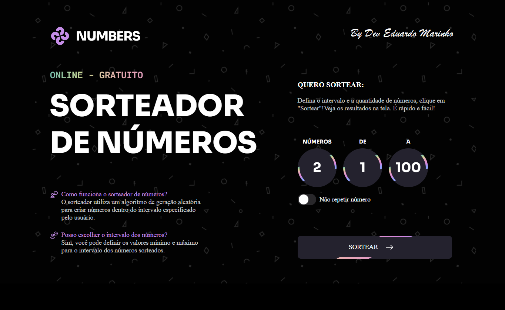

# 🎲 Projeto: Sorteador de Números
**Desenvolvido por:** Dev Eduardo José Marinho  
**Desafio:** Trilha *Fullstack* — Plataforma Rocketseat

## 🚀 Tecnologias Utilizadas
- HTML semântico
- CSS avançado (animações e responsividade)
- JavaScript intermediário (dinamismo e interações)

## 🎯 Descrição
Projeto prático e desafiador que une a estruturação sólida com HTML e estilos marcantes em CSS, culminando numa lógica de sorteio interativa com JavaScript. Aqui, aprendizado encontra criatividade!

- Animações complexas e dinâmicas que dão vida à interface 🎨
- Layout 100% responsivo, adaptado 📱💻
- Código modular e reaproveitável, valorizando boas práticas de desenvolvimento ♻️
- Interface intuitiva com feedback visual em tempo real ⚡

## 📚 Processo
Este projeto foi concluído com muito esforço, dedicação e pesquisa. Cada funcionalidade foi criada com atenção aos detalhes, enfrentando erros e aprendendo com cada tentativa.

## 🖼️ Visual do Projeto
Você pode visualizar o funcionamento 

🧠 Analisar 📚 Aprender ❌ Errar  
    🔁 Refatorar  🛠️ Construirr  
    ->   ->   ->   ->   ->   ->   ->    
→ Esse é o caminho do Dev. — Edu Marinho
